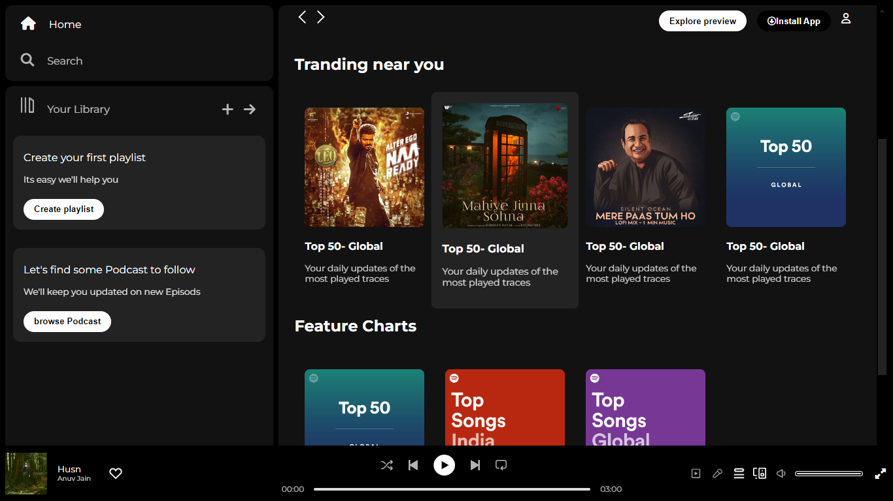

# spotify-clone# Spotify Clone - HTML/CSS Project💻🚀

## Overview
This project is a static clone of the Spotify user interface, developed as part of my HTML and CSS learning journey. It aims to showcase my skills in front-end development using these technologies. Please note that this is a static demo page.

## Screenshots

The website is hosted at: [Spotify Clone](https://open-clone-spotify.netlify.app/)

## Table of Contents

- [Project Structure](#project-structure)
- [Hosted Website Link](#link)
- [Features](#features)
- [Technologies Used](#technologies-used)
- [Setup and Usage](#setup-and-usage)
- [Contributing](#contributing)
- [Authors](#authors)
- [Acknowledgements](#acknowledgements)

## Project Structure

- **index.html**: The main HTML file representing the home page.
- **styles.css**: The CSS file containing the styles for the page.

## Hosted Website Link
This project is hosted online. You can visit the website clone by clicking [here](https://open-clone-spotify.netlify.app/).

## Features

- **Static Page:** This project is a static demonstration of a Spotify user interface clone.
- **HTML/CSS:** The project is built using HTML for structure and CSS for styling.
- **Responsive Design:** The page is designed to be responsive on desktop screens.

## Technologies Used

- HTML
- CSS

